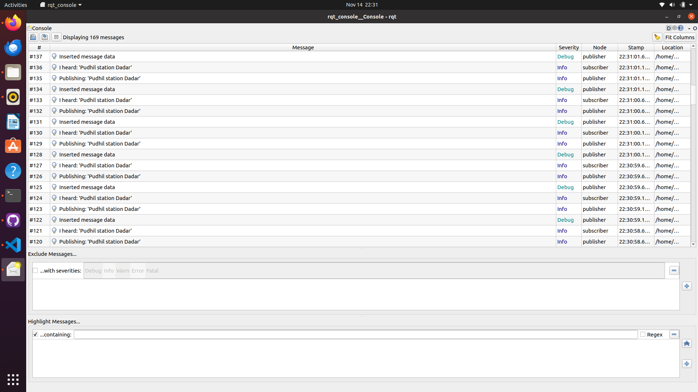

# beginner_tutorials
A repository for ros2 humble for enpm808x

### Author
Manav B Nagda

### Building the ROS package
```bash
# Source ROS
source /opt/ros/humble/setup.bash
# Navigate to workspace
cd ~/ros2_ws/src
git clone https://github.com/mvboiii/beginner_tutorials.git

# Navigate to home directory
cd ..
# Install rosdep dependencies before building the package
rosdep install -i --from-path src --rosdistro humble -y
# Build the package 
colcon build --packages-select beginner_tutorials
# Source the package
. install/setup.bash
# Run the publisher
ros2 run beginner_tutorials talker --ros-args --log-level debug
# Run the subscriber
ros2 run beginner_tutorials listener --ros-args --log-level debug
# Run server_client
ros2 run beginner_tutorials server_client
# Run publisher and subscriber together
ros2 launch beginner_tutorials custom_launch.yaml frequency:=1
```

### CppCheck
```bash
# install cppcheck
sudo apt install cppcheck

# Run in the top-level project directory (eg., in cpp-boilerplate-v2/)
cppcheck --enable=all --std=c++11 -I include/ --suppress=missingInclude $( find . -name *.cpp | grep -vE -e "^./build/" )
```

### CppLint
```bash
# install cpplint:
sudo apt install cpplint

# run in the top-level project directory (eg., in cpp-boilerplate-v2/)
cpplint --filter="-legal/copyright" $( find . -name *.cpp | grep -vE -e "^./build/" )
```

### Results
```bash
Listner Node
[INFO] [1700018867.292848134] [subscriber]: I heard: 'Pudhil station Dadar'
[INFO] [1700018867.793992077] [subscriber]: I heard: 'Pudhil station Dadar'
[INFO] [1700018868.294001988] [subscriber]: I heard: 'Pudhil station Dadar'
[INFO] [1700018868.794027055] [subscriber]: I heard: 'Pudhil station Dadar'

Talker Node
[INFO] [1700016165.092692397] [publisher]: Publishing: 'Pudhil station Dadar'
[DEBUG] [1700016165.592139467] [rcl]: Calling timer
[DEBUG] [1700016165.592408611] [publisher]: Inserted message data
[INFO] [1700016165.592547457] [publisher]: Publishing: 'Pudhil station Dadar'
[DEBUG] [1700016166.092235794] [rcl]: Calling timer
[DEBUG] [1700016166.092515204] [publisher]: Inserted message data
[INFO] [1700016166.092656729] [publisher]: Publishing: 'Pudhil station Dadar'

Combined Yaml Results
ros2 launch beginner_tutorials custom_launch.yaml frequency:=1
[INFO] [launch]: All log files can be found below /home/mvboiii/.ros/log/2023-11-14-22-21-27-593049-mvboiii-27243
[INFO] [launch]: Default logging verbosity is set to INFO
[INFO] [talker-1]: process started with pid [27245]
[INFO] [listener-2]: process started with pid [27247]
[talker-1] [INFO] [1700018487.750407245] [talker]: Parameter 'frequency' set to: 1
[talker-1] [INFO] [1700018488.751274866] [talker]: Publishing: 'Pudhil station Dadar'
[listener-2] [INFO] [1700018488.752689921] [listener]: I heard: 'Pudhil station Dadar'
[talker-1] [INFO] [1700018489.751219687] [talker]: Publishing: 'Pudhil station Dadar'
[listener-2] [INFO] [1700018489.752521336] [listener]: I heard: 'Pudhil station Dadar'
[talker-1] [INFO] [1700018490.751135481] [talker]: Publishing: 'Pudhil station Dadar'
[listener-2] [INFO] [1700018490.752422961] [listener]: I heard: 'Pudhil station Dadar'

Results after Changing the string
[talker-1] [INFO] [1700018543.750454151] [talker]: Publishing: 'Pudhil station Dadar'
[listener-2] [INFO] [1700018543.751711730] [listener]: I heard: 'Pudhil station Dadar'
[talker-1] [INFO] [1700018544.358215253] [talker]: Received service request
[talker-1] Input: 'pudhil_station_matunga'
[talker-1] [INFO] [1700018544.358252903] [talker]: Sending back response: 'pudhil_station_matunga Edited by service'
[talker-1] [INFO] [1700018544.750408556] [talker]: Publishing: 'pudhil_station_matunga Edited by service'
[listener-2] [INFO] [1700018544.751770814] [listener]: I heard: 'pudhil_station_matunga Edited by service'
[talker-1] [INFO] [1700018545.750279407] [talker]: Publishing: 'pudhil_station_matunga Edited by service'

```
## rqt_console log output

